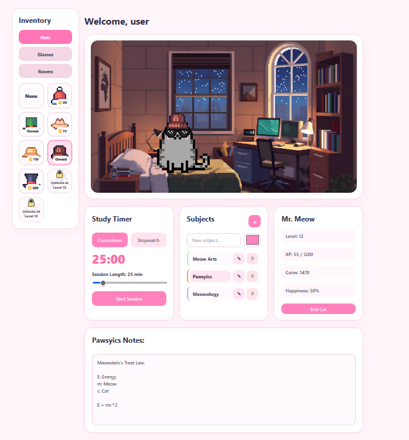

# StudyCat Frontend

## App Preview

## Run

1. `npm install`
2. Create `.env` in this folder with:
   - `VITE_BACKEND_URL=http://localhost:3000`
3. `npm run dev`

## Scripts In package.json

- `npm run dev`
- `npm run build`
- `npm run preview`
- `npm run lint`

## Routes In App.jsx

- `/`
- `/sign-up`
- `/sign-in`
- `/create-cat`
- `/dashboard`
